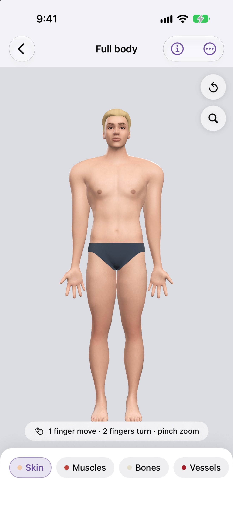
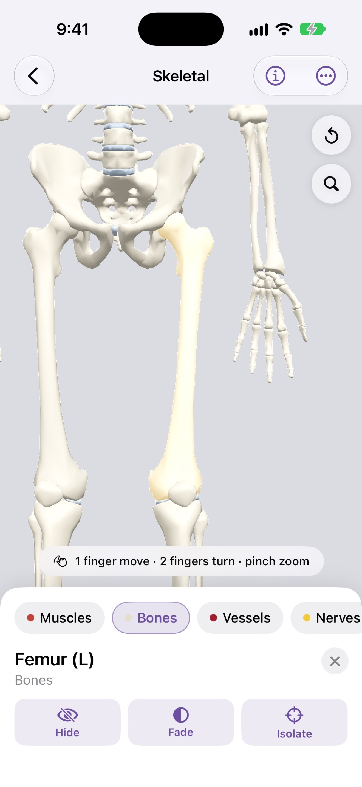
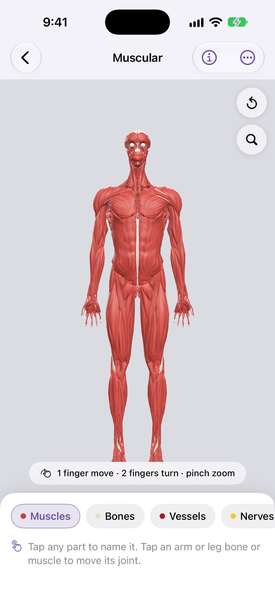
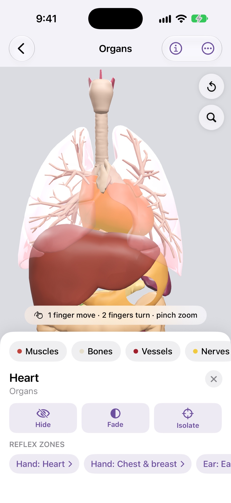
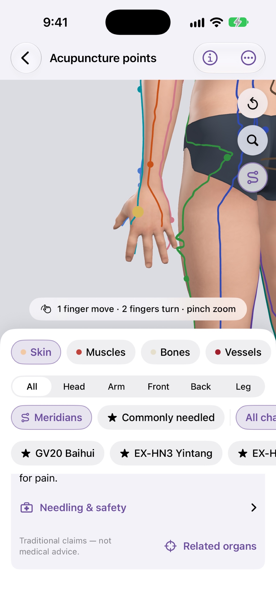
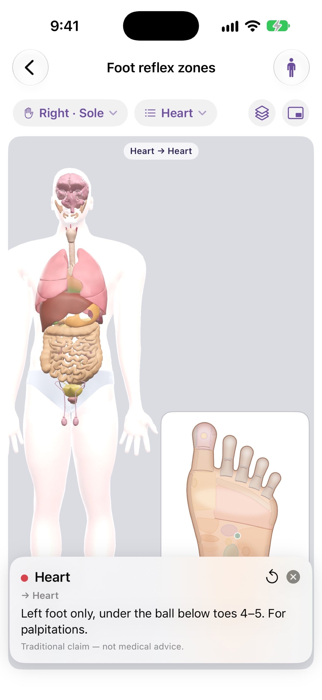
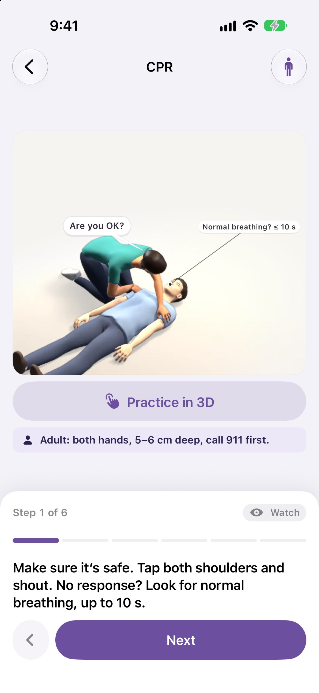
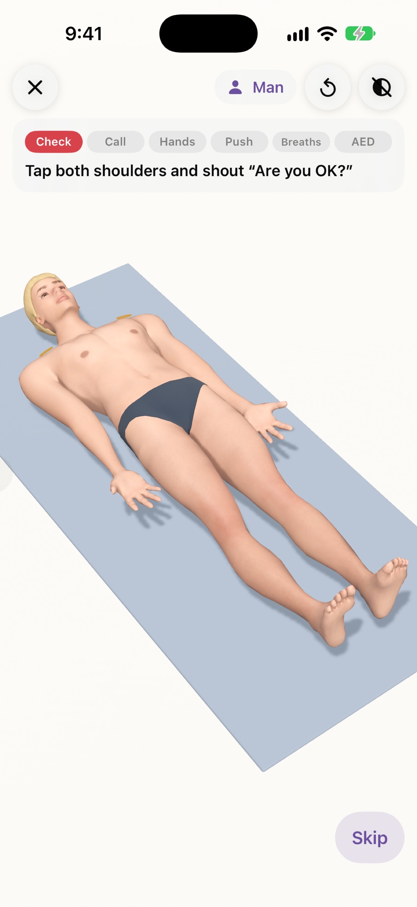
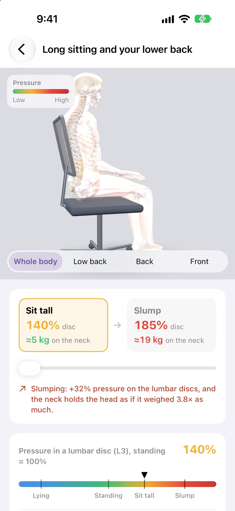
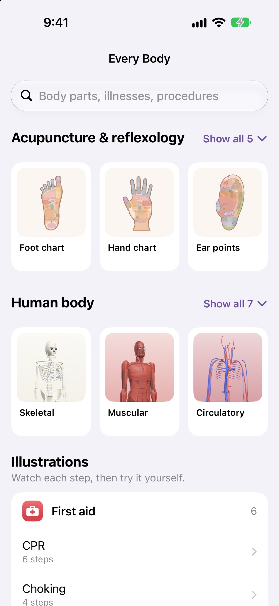

# Every Body

> 🚧 Work in progress — native iPhone app (SwiftUI + RealityKit): schematic body, reflex charts, 18 illustrations.

A free, offline way to explore the human body — every system, the hand/foot/ear reflex maps,
and how common conditions and first aid work. Bilingual (English / 中文).

Everything is **schematic, not lifelike**: drawn from simple geometry and math, judged on
correct positions and cause → effect (see `docs/design/mvp/DESIGN.md`). Every feature is
**watch, then try** — an animation plus something to drag, tap, hold or compare.

## Screenshots

| | | |
|---|---|---|
| **Full body**<br> | **Skeleton**<br> | **Muscles**<br> |
| **Organs**<br> | **Acupuncture**<br> | **Foot chart**<br> |
| **CPR**<br> | **CPR practice**<br> | **Posture**<br> |
| **Home**<br> | | |

## What's in it

- **Body** — real skeleton (Z-Anatomy, ~200 tappable bones) and textured skin figures (MakeHuman bodies, faces and
  hair stylized after Blender Studio's Snow / Rain: male / female ×
  infant, toddler, child, adult, 65+, pregnant × six appearances, modest underwear) in `Resources/Models/`; muscles,
  vessels, nerves and organs still math-built (`Resources/Data/body.json`, meshes in `Sources/Body/`). Layers, tap to
  name, Hide / Fade / Isolate / Undo, bend shoulder, elbow and knee (muscles bulge). Settings → Appearance / Show underwear.
- **Reflex Map 穴位反射图** — hand, foot and ear charts with zones per the standard maps
  (GB/T 13734 ear points, WHO acupoints). Press a zone → a pulse travels to the organ it's
  said to act on. Tapping an organ lists its zones.
- **Acupuncture 针灸穴位** — 67 most-used points (WHO 2008 locations, cun from bony landmarks)
  and the 14 meridians drawn on the 3D skin. Filter by region / meridian / commonly needled;
  a point card gives code, names, location, traditional uses, needling depth, safety and
  pregnancy / age cautions.
- **Illustrations 图解** — 18 topics in 5 groups: bone setting, first aid (CPR, choking,
  bleeding, burns, sprain), blood sugar / pressure / fats, illnesses (stroke, heart attack,
  cold vs flu, asthma, reflux, kidney stones), pregnancy & labour. Each scene is a small
  model (`Sources/Illustrations/Scenes/`).
- **Search** across all of it, EN or 中文; **Settings** for names language, background,
  auto-rotate, body.

Not medical advice — effects of reflex points are traditional claims.

## Design docs

[`docs/design/mvp/`](docs/design/mvp/DESIGN.md) — design, UI/UX mockups, implementation plan.

## Setup

Native SwiftUI + RealityKit (iOS 18+). No Expo, Metro or JS toolchain.

```bash
brew install xcodegen          # once
xcodegen generate              # EveryBody.xcodeproj from project.yml
```

Install on a connected iPhone — put `DEVELOPMENT_TEAM` and `IOS_BUNDLE_ID` in the gitignored
`.env.local` first:

```bash
make device                    # = scripts/install-ios-device.sh; STORE=us (Canada/US) by default
make device STORE=cn           # App Store region → Info.plist AppStoreRegion, read via storeRegion()
```

App Store release: `make release` (archive + upload); screenshots on the simulator:
`scripts/screenshot.sh install && scripts/screenshot.sh all /tmp/eb-shots && make screenshots SHOTS=/tmp/eb-shots`; fields and steps in
[`docs/release/listing.md`](docs/release/listing.md).

Data lives in `Resources/Data/*.json` (body parts, organs, joints, points, charts, systems).
App icon: `venv/bin/python scripts/make_icons.py` (needs Pillow in `venv/`).
Body: `venv/bin/python scripts/gen_body.py` regenerates `body.json` and point positions; acupoints and meridian
courses live in `scripts/acupuncture.py` (cast onto the skin lofts, then `scripts/models/snap_points.py` moves them onto
the real skin figure). Check placement with
`POINTS=acupuncture [FOCUS=acu-li11] [PANX=0.42] [PITCH=0.9] scripts/render_body/render.sh out.png skin <yaw> <focusY> <distance>`.
Real models: `scripts/models/build.sh` (Blender 4.5 headless + MPFB2, raw downloads in gitignored `tools/`) rebuilds
`Resources/Models/` and prints a size table; `REAL_MODELS=0` (env) falls back to the generated skeleton and skin.
Skin figures: `scripts/models/build.sh fit` (MPFB humans → `build/models/figure`; faces drawn onto the Snow / Rain heads
by `face_fit.py`; sculpted hair) then `build.sh pack` (→ `figure.bin`, textures, points re-snapped), then `internals`;
`scripts/render_body/grid.sh /tmp/grid` renders heritage / age / underwear / inside contact sheets.
Third-party licences: `LICENSES/THIRD_PARTY.md` (Z-Anatomy CC BY-SA 4.0, MakeHuman CC0, Blender Studio Snow / Rain
CC BY), also in Settings → Credits.
Illustrations: `scripts/render_scenes/render.sh /tmp/scenes` renders every step to PNG on the Mac.
Reflex charts: `venv/bin/python scripts/render_charts/gen_charts.py` regenerates `charts.json` (needs shapely);
`scripts/render_charts/render.sh` renders every face to `build/charts/` with the app's `ChartCanvas`.
